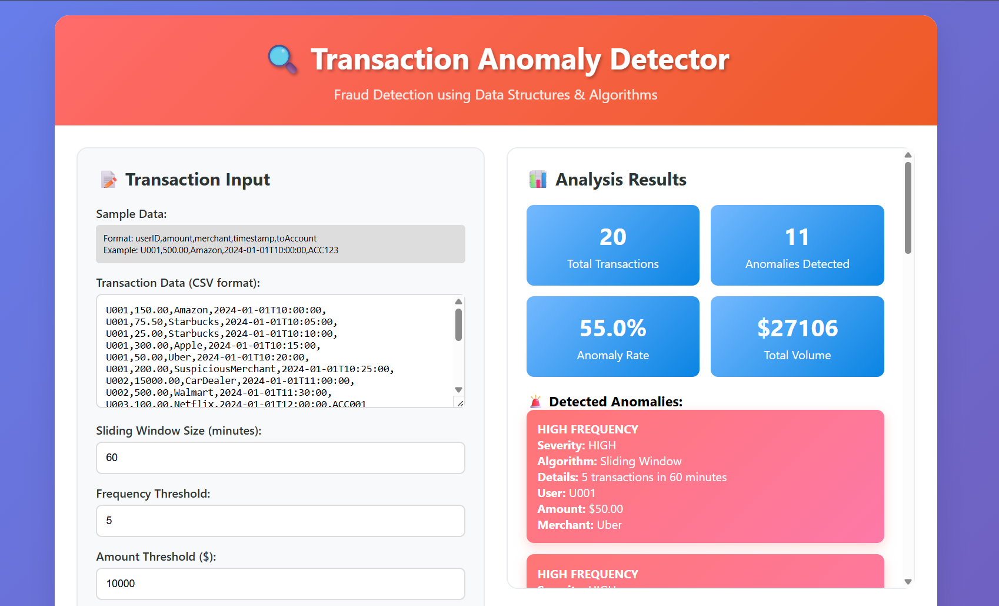

# 📊 Transaction Anomaly Detector  


## 🌟 About Transaction Anomaly Detector  
This is a simple, open-source web tool that detects suspicious patterns in financial transactions using core **Data Structures and Algorithms (DSA)** — without relying on machine learning. It is lightweight, explainable, and works entirely in your browser.

---

## ✨ Features  
- **DSA-Powered Detection**: Implements sliding window, hash maps, graphs, and trie-based techniques.  
- **Real Time Stats**: Displays anomalies, severity levels, and transaction summaries.  
- **Easy To Use**: Works in any browser with no backend or database.  
- **No Machine Learning Required**: Transparent and lightweight, with no training or black-box models.  

---

## 💻 Technologies Used  
- HTML  
- CSS  
- JavaScript  
- Core DSA Algorithms (Sliding Window, Graphs, Trie, Hash Maps)

---

## 🧠 How It Works  
Each transaction is analyzed in real-time using algorithms like:  
- **Sliding Window**: Detects rapid high-frequency usage  
- **Graph Cycle Detection**: Catches circular fund transfers  
- **Trie Search**: Flags suspicious merchant names  
- **Hash Map Analysis**: Spots unusual user patterns  

This results in a fast and efficient system that can be used in detecting suspicious transactions.

---

## 🤝 Contributing  
We welcome contributions from everyone! This is a beginner-friendly project, perfect for those learning algorithms or participating in programs like GSSoC’25.

---


## Getting Started with Your First Contribution: 
1.  Fork this repository.
2. Clone your forked repository to your local machine:
```bash
git clone https://github.com/VaishnaviMelagiri/Transaction-Anomaly-Detector.git 
```
3. Create a new branch for your changes:
```bash
git checkout -b your-contribution-branch-name
```
4. Commit your changes with a clear message:
```bash
git commit -m "Added [File Name]" 
```
5. Push your changes to your fork:
```bash
git push origin your-contribution-branch-name
```
6. Open a Pull Request (PR) on GitHub from your branch to the main branch. Provide a descriptive title and details about your contribution.